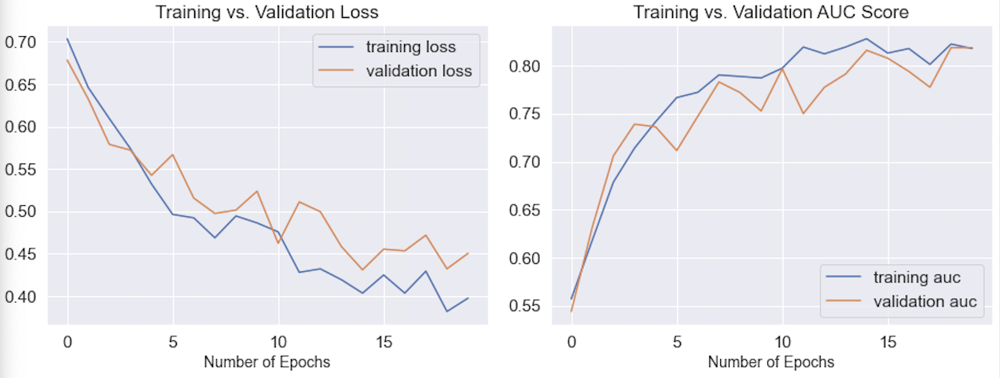
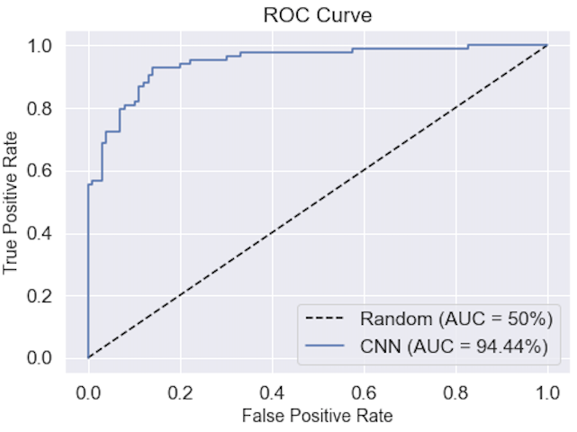
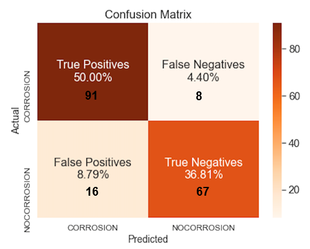

  
# Deep Learning for Automated Corrosion Detection

## Author: Pengju Sun

# Abstract

Visual inspection is a vital component of asset management that stands to benefit from automation. Using artificial intelligence to assist inspections can increase safety, reduce access costs, provide objective classification, and integrate with digital asset management systems. The automated detection of corrosion from images presents significant advantages in terms of corrosion inspections. The advantages include access to remote locations (wind turbine corrosion detection, underground pipeline corrosion detection, subsea pipeline corrosion detention, etc.), mitigation of risk of inspectors, cost savings, and detecting speed. The work presented here used deep learning convolutional neural networks to build automated corrosion detection models. To approach human-level accuracy, the training of a deep learning model requires a massive dataset and intensive image labeling. A large dataset of 1819 images of CORROSION and NO CORROSION were labeled by a subject matter expert (myself as a corrosion engineer). The results and findings illustrate researchers setting out to develop deep learning models for detecting and locating specialist features.

# Introduction    

Corrosion is defined as the deterioration of a material, usually a metal, because of reaction with its surrounding environment (Chilingarian, 1989; Popoola, Grema, Latinwo, Gutti, Balogun, 2013). The reaction can be known as the electrochemical process, which contains various solid and liquid substances. Corrosion can lead to the loss of the purity of the metal. When a metal structure undergoes corrosion, it loses its strength, and the tendency to experience structural collapse increases. For example, ships, tankers, pipelines, wind turbines, and concrete rebars are often subject to the dangerous effects of corrosion. A study by NACE [1] estimates the global annual cost of corrosion at US$2.5 trillion, which is about 3.4% of the worldwide GDP （2013). These numbers solely represent the direct costs such as forced shut-downs or accidents; neither individual safety nor environmental consequences are included. Therefore, effective corrosion control methods become highly critical in preventing the damaging effects of corrosion. Various methods are widely used in the industry to control and prevent corrosion. These methods include cathodic and anodic protection, corrosion inhibitors, material selection, application of internal and external protective coatings, corrosion monitoring, and inspections (Meresht, Farahani, & Neshati, 2011; Popoola et al., 2013; Samimi & Zarinabadi,2011). Early detection of structural degradation prior to failure does not only have financial benefits. Still, it can also prevent catastrophic collapses of structures and avoid harmful situations for both humans and the environment.

The recent improvements in Artificial Intelligence (A.I.) for object recognition are largely attributed to the emergence of deep learning artificial neural networks. As one of the major fields of A.I., deep learning mimics the working of the human brain in processing data for use in detecting objects, recognizing speech, and creating patterns for use in decision making. Deep learning has developed as the natural progression from 'shallow networks' to multi-layered networks of neurons that are able to transform representations (of data, including images) from simple to complex, with increasing layer depth \[2\]. For corrosion protection, the first step towards the maintenance of structures is the visual inspection. Nowadays, this is mainly done by humans to collect qualitative data. Despite that these inspectors are certificated and experienced, the performance of this time-consuming method is subjective and largely dependent on the experience and qualifications of the individual (Agdas et al., 2016).

On top of that, some locations of structures are difficult or completely inaccessible because of safety reasons, such as deep-sea pipelines, oil tanks, wind turbines, and some hindering constructions. In this paper, supervised learning image classification towards the detection of corrosion is investigated. The purpose of this research is to support the inspectors during the visual corrosion inspection to quickly detect corrosion through images taken by the drone reaching the inaccessible locations without bringing the inspector's safety in danger. In addition, this research also aims to develop a human-level accuracy model for automated corrosion detection, thus increasing the visual inspection efficiency.

# Data

## Data Collection

Supervised learning utilizes 'labeled data' to train neural networks. Such data, which could be an image, will include identification of whether or not corrosion is present in that image. In general terms, more training data leads to better deep learning accuracy. It has been demonstrated that using more training data outperforms supervised learning models developed with more accurately labeled data, provided that the incidence of so-called adversarial labeling (i.e., incorrect labeling of training data) is low \[3,4,5\]. There is a need for a certain amount of data to learn a good, generalized relationship between the inputs and the desired outputs. Without the benefit of a publicly available dataset, labeling large quantities of data is the first and most important step toward developing accurate deep learning models. In this research, the dataset is labeled into two categories, which are CORROSION and NO CORROSION. The entire dataset includes a total number of 1819 images containing 990 images of CORROSION and 829 images of NO CORROSION. These images were collected from the internet and labeled by the author with a background in corrosion engineering.

All the labeled CORROSION and NO CORROSION images were collected by scraping images from google. Selenium was used to automate web browser interaction with Python. Selenium pretends to be a real user, opens the browser, moves the cursor around, and clicks buttons if you tell it to do so. Please reference this complete guide of “[Image Scraping with Python](https://towardsdatascience.com/image-scraping-with-python-a96feda8af2d)” for the detailed explanation and steps with codes.

The CORROSION images were scraped from Google Images using keyword searches that include eight categories of corrosion problems, such as ‘Steel Corrosion/Rust,’ ‘Ships Corrosion,’ ‘Ship Propellers Corrosion,’ ‘Cars Corrosion,’ ‘Oil and Gas Pipelines Corrosion,’ ‘Concrete Rebar Corrosion,’ ‘Water/Oil Tanks Corrosion,’ and ‘Stainless Steel Corrosion,’ The NO CORROSION images were also scraped from Google Images using the same terms without corrosion. The following demonstrates the examples of CORROSION and NO CORROSION images in each category.

### Steel Corrosion/Rust
          
Rust is the most common form of corrosion. Rusting is oxidation of iron in the presence of air and moisture and occurs on surfaces of iron and its alloys (steel).

<figure>

<figcaption align = "center"><b>Figure 1: Corrosion and No Corrosion images of the steel plate</b></figcaption>
</figure>

### Ship Corrosion

The ship is one that continuously faces corrosion challenges stemming from marine environments, particularly seawater. Seawater contains a significant concentration of dissolved salts and is very corrosive to steel, infrastructures, and assets. Ship corrosion is a major hazard for the industry. The deterioration of these structures causes higher maintenance costs, early system failures, or an overall shortened service life.

<figure>

<figcaption align = "center"><b>Figure 2: Corrosion and No Corrosion images of the ship hull</b></figcaption>
</figure>

### Ship Propeller Corrosion

Propeller performance plays an important part in a ship’s operation. Therefore, maintaining propellers in a smooth and corrosion-free condition is critical to the efficient propulsion of a vessel.

<figure>

<figcaption align = "center"><b>Figure 3: Corrosion and No Corrosion images of the ship propeller</b></figcaption>

</figure>

### Car Corrosion
          
Most of the cars are made of steel. The rust of vehicles can make an expensive car look like a beater. It lowers the resale value of a vehicle, and if left untreated, will make your vehicle unsafe to drive.

<figure>

<figcaption align = "center"><b>Figure 4: Corrosion and No Corrosion images of the car</b></figcaption>
</figure>

### Oil and Gas Pipelines Corrosion

Corrosion is the destructive attack of a material by reaction with its environment \[6\] and a natural potential hazard associated with oil and gas production and transportation facilities \[7\]. Almost any aqueous environment can promote corrosion, which occurs under numerous complex conditions in oil and gas production, processing, and pipeline systems \[8\]. Crude oil and natural gas can carry various high-impurity products which are inherently corrosive. In the case of oil and gas wells and pipelines, such highly corrosive media are carbon dioxide (CO2), hydrogen sulfide (H2S), and free water \[9\]. Continual extraction of CO2, H2S, and free water through oil and gas components can make the internal surfaces of these components suffer from corrosion effects. Oil and gas pipeline corrosion contains several different corrosion types, which include CO2 corrosion, H2S Corrosion, oxygen corrosion, galvanic corrosion, crevice corrosion, microbiologically induced corrosion, and stress corrosion cracking. Figure 5 shows the diagrammatic representation of oxygen corrosion.

<figure>

<figcaption align = "center"> <b>Figure 5: Corrosion and No Corrosion images of the oil and gas pipelines</b></figcaption>
</figure>

### Concrete Rebar Corrosion

Corrosion of reinforcing steel and other embedded metals is the leading cause of deterioration in concrete. When steel corrodes, the resulting rust occupies a greater volume than the steel. This expansion creates tensile stresses in the concrete, which can eventually cause cracking, delamination, and spalling.

<figure>

<figcaption align = "center"> <b>Figure 6: Corrosion and No Corrosion images of the concrete rebar</b></figcaption>
</figure>

### Water Storage Tank Corrosion

In a water tank, the steel wall of the tank is the anode. It gives off electrons that flow into the water. The water is the cathode, and the tank's surface is the closure circuit that connects the anode and cathode. As the electrons flow out of the steel wall of the tank, the tank corrodes. Over time, this corrosion can discolor the water and can result in leaks in the tank wall.

<figure>

<figcaption align = "center"> <b>Figure 7: Corrosion and No Corrosion images of the water tank</b></figcaption>
</figure>

### Stainless Steel Corrosion
 
Stainless steel is one of the most durable of metals. Its mechanical properties enable its structures to remain highly resistant to rust. Stainless steels fine layer of chromium oxide is a natural coating to protect stainless steel from corrosion. However, if this coating is attacked by certain species and damage is too extensive, corrosion can occur.

<figure>

<figcaption align = "center"> <b>Figure 8: Corrosion and No Corrosion images of the stainless steel fastner</b></figcaption>
</figure>

# Methodology
 
## Data Exploring
 
The entire dataset was split into the ratio of 70% train, 20% validation, and 10% test. All the three groups of datasets have the same ratio of CORROSION and NO CORROSION, which is 54.4% of corrosion images and 45.6% of no corrosion images.

<figure>

<figcaption align = "center"> <b>Figure 9: Distribution of CORROSION and NO CORROSION training dataset</b></figcaption>
</figure>

## Image Preprocessing

Next, these images were processed through the pixel normalizations and data augmentation.

### Pixel Normalization

For image data, pixel values are integers with values between 0 to 255. As neural networks process inputs using small weight values, larger values slow down the learning process. Normalization pixels would shrink the integers to values between 0 to 1; hence it's a good practice to normalize pixels to ensure efficient computation.

### Data Augmentation

In addition, I've also applied some augmentations to the images: zoomed-in, sheer, horizontal flip, and vertical flip. Data augmentation is an excellent practice to add more data to the existing dataset and add minor alterations and diversity to avoid the model from overfitting to training data.

## Modelling

Around 30 models were trained with different combinations of activations, number of feature maps, dropouts, l1/l2 regulations, and batch normalizations. The following Figure 10 is the architecture of my best-performance model.

<figure>

<figcaption align = "center"> <b>Figure 10: Convolution Neural Network Architecture</b></figcaption>
</figure>

The best performance model has four convolutional 2D layers, with each followed by a max-pooling layer. I also added a drop-out layer after each max-pooling layer to reduce overfitting to the training dataset. Finally, after being flattened, it is fed into a fully connected layer with ReLU activation. In the end, I used the sigmoid activation function to predict the output probabilities for this binary classification problem.

# Results

Figure 11 shows the performance of how our deep learning model is being trained through each epoch. The model early stopped at epoch number 20 (total epoch number = 100) when the chosen performance (minimize loss) stopped improving. We can account for this by adding a delay to the trigger in terms of the number of epochs we would like to see no improvement. This can be done by setting the "patience." In this case, I set patience = 7.

As you can see, for the chart on the left, as the number of epoch increases, the lines of validation loss and training loss approach each other, which means that our model doesn't seem to have much overfitting or underfitting. For the chart on the right, the line of training and validation accuracy score converges to a point where they are almost equal in the end.

<figure>
<figcaption align = "center"> <b>Figure 11: Model learning curves: Loss and Accuracy Score </b></figcaption>
</figure>

Our test set yields an AUC score of 94.44%, which indicates that our best performance CNN model does a great job at ranking the data by its class in the test set (Figure 12). 

<figure>
<figcaption align = "center"> <b>Figure 12: ROC curve and AUC score </b></figcaption>
</figure>

In this research, we aim to have a high recall number for detecting corrosion as any missed corrosion problem or delayed treatment could lead to catastrophic failure of the structures that cause loss of assets or even human life.    Our best performance model achieves 92% for recall, which did an excellent job of detecting corrosion. The confusion matrix shows [Figure 13] that our model correctly classified 91 out of 99 corrosion images in the test set. At the same time, the false positives and false negatives are 8.79% and 4.4%, which also shows that our model did a decent job in detecting whether an image contains corrosion or not.

<figure>
<figcaption align = "center"> <b>Figure 13: Confusion Matrix </b></figcaption>
</figure>

# Conclusion

This research proposes building a deep learning model using the CNN method and automatically learning the corrosion behaviors to classify them. 
1. The results confirm that the implemented deep learning CNN algorithm is a promising tool for automated detection of corrosion.

2. By giving a wide variety of corrosion images, our model can efficiently find the corrosion issues with high accuracy. 

3. A high accuracy automated corrosion detection model can reduce the cost of corrosion inspections and chances of human life in danger.

# Future Work

In the future work, there is still room for improvement.

1. To increase the model's overall accuracy, increasing the number and diversity in the dataset is a must. Specifically, for corrosion detection and segmentation (i.e..., per-pixel labeling), it was found that there is a need for 65,000 labeled images required to achieve an essentially human-level accuracy for an A. I model \[10\].

2. In the context of model accuracy, the model training is influenced by the labeled images. The rate of model accuracy improvement is inherently linked to the quality of the image labeling. The identification of corrosion is a highly complex task. Labeling high-quality corrosion images require experts to have knowledge of a range of materials in an image. Also, it needs experts to assess the difference between what may be brown or red paint and corrosion. 

3. Including image segmentation and using U-Net CNN architecture \[11\]\[12\] further improves the model's overall performance to reach human-level accuracy of corrosion detection. Image segmentation can let you know where an object is located in the image, the shape of that object, which pixel belongs to which object, which helps understand the image at a much lower level. U-net is an architecture of semantic segmentation. It has been proven quite helpful for biomedical image segmentation. In corrosion detection, it is quite worthy of using the U-net architecture model to detect localized corrosion problems, including pit corrosion and crevice corrosion. 

# Reference

\[1\]  NACE IMPAC: ECONOMIC IMPACT. http://impact.nace.org/economic-impact.aspx

\[2\]  J. Yosinski, J. Clune, A. Nguyen, T. Fuchs, H. Lipson, Understanding Neural Networks Through Deep Visualization, Int. Conf. Mach. Learn. - Deep Learn. Work.  [2015\. (2015) 12. http://arxiv.org/abs/1506.06579.](http://arxiv.org/abs/1506.06579)

\[3\] W. Nash, T. Drummond, N. Birbilis, A review of deep learning in the study of materials degradation, Npj Mater. Degrad. 2 (2018) 1–12. doi:10.1038/s41529-018- 0058-x.

\[4\] D.E. Rumelhart, G.E. Hinton, R.J. Williams, Learning representations by back- propogation errors, Nature. 323 (1986) 533–536.

\[5\] Z. Cui, G. Gong, The effect of machine learning regression algorithms and sample size on individualized behavioral prediction with functional connectivity features, Neuroimage. 178 (2018) 622–637. doi:10.1016/j.neuroimage.2018.06.001.

\[6\] Roberge PR (2000) Handbook of corrosion engineering. McGraw-Hill, New York

\[7\] Kermani MB, Smith LM (1997) CO2 corrosion control in oil and gas production: design considerations. The Institute of Materials, European Federation of Corrosion Publications, London

\[8\] Champion Technologies (2012) Corrosion mitigation for complex environments. Champion Technologies, Houston

\[9\] Lusk D, Gupta M, Boinapally K, Cao Y (2008) Armoured against corrosion. Hydrocarb Eng 13:115–118

\[10\] W. Nash, T. Drummond, N. Birbilis, Deep Learning AI for Corrosion Detection, in: NACE International (Ed.), Corros. 2019, Nashville, TN, 2019.

\[11\] O. Ronneberger, P. Fischer, T. Brox, U-Net: Convolutional Networks for Biomedical Image Segmentation, (2015) 1–8. doi:10.1007/978-3-319-24574-4\_28

\[12\] https://paperswithcode.com/method/u-net

